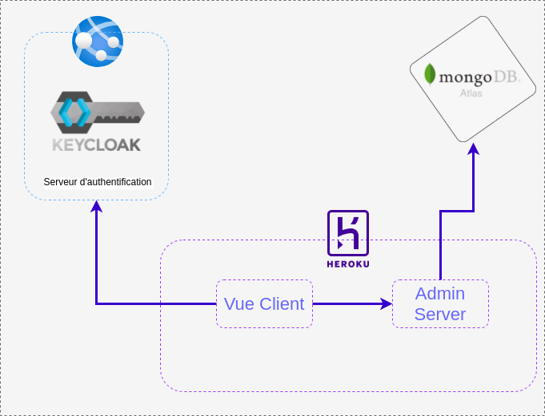

# Travilias - admin

Ce projet sert d'interface d'administration à l'application Travilias (voir : [documentation travilias](./docs/Travilias.md))

Une preview de l'application est disponible : [Preview](http://admin.travilias.com)

## Contributeurs

- **Anthony Quéré** : Développeur
- **Kilian Debraux** : Développeur

## Architecture

**Suite a plusieurs problèmes dues au déploiement de Keycloak, l'utilisation du HTTPS n'a pas été possible. Si vous utilisez le lien de preview ci dessus (le lien de la preview ci-dessus est bien en HTTP). Par conséquent nous recommandons de ne pas utiliser de mot de passe trop sensible.**

Afin de minimiser les coûts de mise en production, l'application est déployé à travers divers services. Les parties Backend et Front end sont disponibles sur Heroku. Le serveur d'authentification Keycloak tourne sur Azure App service et l base de donnée est gérée par MongoDB Atlas. 

Suite à des problèmes SSL côté Azure, la connection au serveur d'authentification n'est pas suffisamment sécurisée, c'est pourquoi, **nous recommandons l'utilisation de mot de passe non sensibles pour la création de compte**. 

Nous n'avons pas eu le temps d'ajouter Keycloak dans l'authentification du Backend. Cependant, le code vue pourrait très simplement s'y authentifier car le token d'authentification est accessible par le store VueX.

## Mise en place

L'application est entièrement disponible en ligne, cependant vous pouvez aussi la déployer en local. 

### Déployer le front-end
Pour déployer le client vue, il vous suffit de cloner le repository puis d'installer les dépendances avec un `npm install`. Les variables d'environment par défaut sont situées dans le fichier `.env`. Elles permettent de se connecter par défaut au Backend sur Heroku et au *Keycloak* sur *Azure App Service*.

### Déployer le Backend
Pour utiliser le Backend en local, nous vous invitons à regarder notre documentation sur le repository suivant : [https://github.com/Travilias/Travilias-admin-server](https://github.com/Travilias/Travilias-admin-server)

### Déployer Keycloak
Pour deployer keycloak, nous vous invitons à utiliser docker (voir la documentation sur [Docker Hub](https://hub.docker.com/r/jboss/keycloak/))

## Choix technologique
Nous avons développé un Backend en nodejs/express car c'est une technologie que nous connaissons bien. Notre architechture s'inspire largement de l'architecture *Clean Code* popularisée par *Uncle Bob*. Nous avons utilisé une base de donnée mongodb car elle est simple à mettre en place, à utiliser et à déployer.

Nous avons utilisé un serveur d'authentification Keycloak car c'est un système simple à mettre ne place et proposant beaucoup de services par défaut permettant d'implémenter simplement des OAuth2 avec Google et GitHub par exemple ou encore des connections par SAML ce qui pourrait être très intéressant pour une utilisation en entreprise. Afin de simplifier le développement et de palier à nos problèmes de ssl Azure, nous utilisons le service classique de keycloak permettant de créer un compte avec un username et un mot de passe.

